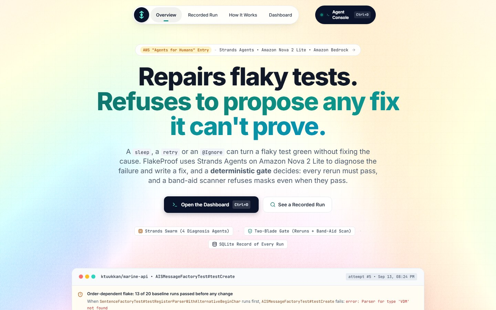
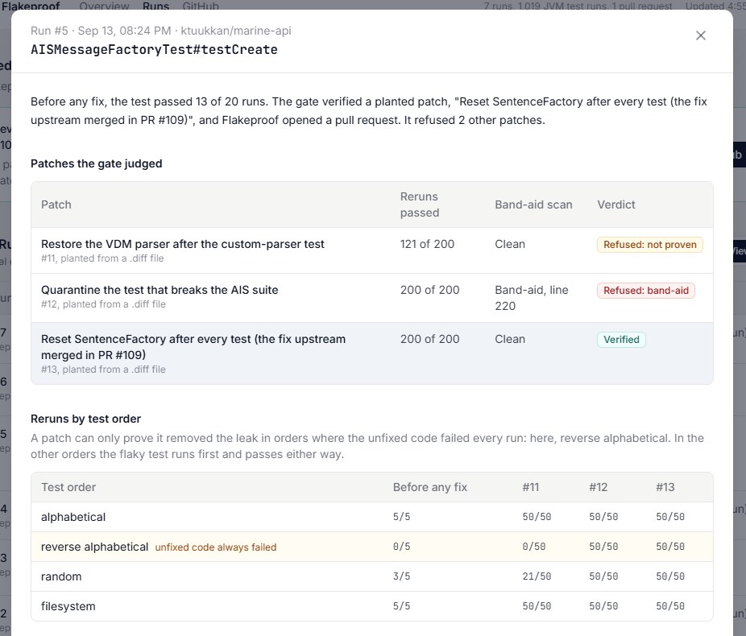
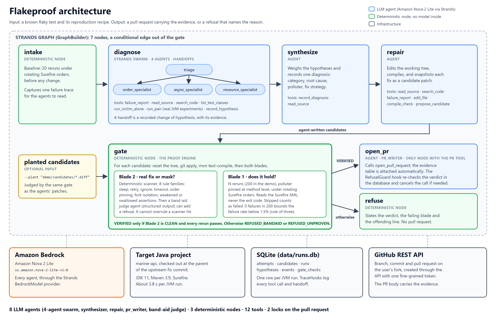
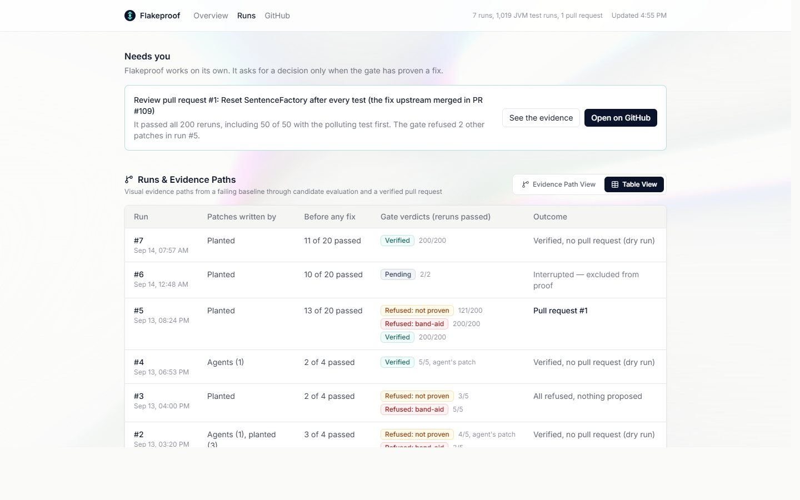
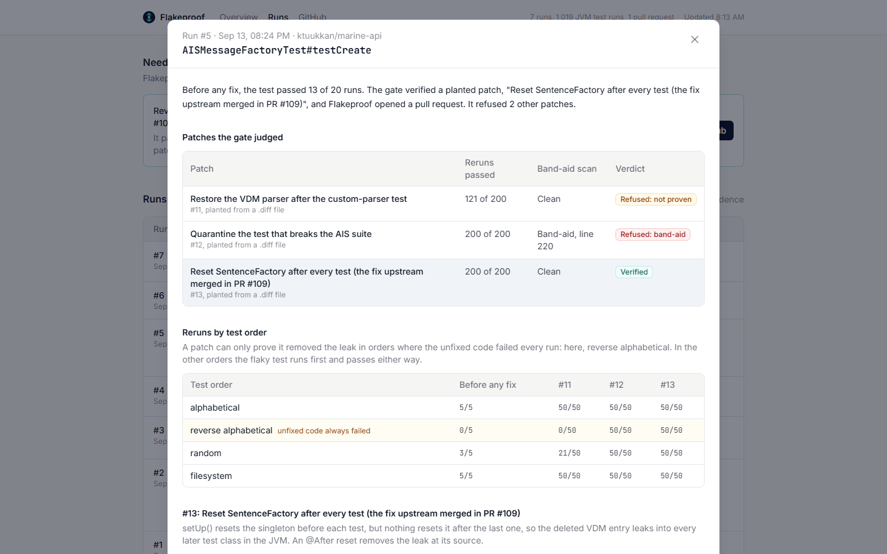

# Flakeproof

Flakeproof takes flaky-test duty off a Java team's plate. Built with Strands Agents, its agents find the test that leaves shared state behind and write a fix; a deterministic gate then reruns every fix under rotating test orders and scans it for band-aids such as `@Ignore`, retries and sleeps. You get involved only when there is a decision to make: a pull request that carries its proof, or a refusal that names the line it would not accept.

Built with Strands Agents and Amazon Nova 2 Lite on Amazon Bedrock for the AWS Agents for Humans Hackathon.




## Results

Flakeproof was run on a real order-dependent flaky test in [marine-api](https://github.com/ktuukkan/marine-api), an open-source Java library, and judged three candidate fixes with 200 reruns each (September 13, 2026). Before any change, the test passed 13 of 20 runs.

| Candidate fix | Reruns passed | Band-aid scan | Verdict |
|---|---|---|---|
| Re-register the VDM parser at the end of the polluting test | 121 / 200 | Clean | `REFUSED_UNPROVEN` |
| `@Ignore` the polluting test | 200 / 200 | `@Ignore` on line 220 | `REFUSED_BANDAID` |
| Reset the shared factory after every test (the maintainers' fix) | 200 / 200 | Clean | `VERIFIED` |

The `@Ignore` patch passed every rerun, so a check based on reruns alone would have approved it. Flakeproof refused it and reported the offending line. The first patch registers the test double instead of the real parser: it failed all 50 reverse-alphabetical runs and 29 of 50 random runs, each with `VDMParser cannot be cast to AISSentence`.



For the verified fix, Flakeproof opened [pull request #1](https://github.com/sidharthnair7/marine-api/pull/1) on a fork of marine-api. It contains one commit that adds six lines, and the description includes the rerun numbers from before and after the fix. The verified fix passed all 50 reverse-alphabetical runs, the order in which the unfixed code failed every time.

The run took 36 minutes 51 seconds for 620 JVM executions.

## The problem

A flaky test passes and fails on the same code. When one breaks a build, someone has to work out whether the failure is real, find the cause, write a fix and convince reviewers that the fix holds.

Automated repair tools exist, and trust is where they struggle. FlakyGuard repairs 47.6% of reproducible flaky tests at industry scale, and developers accept 51.8% of its fixes ([Li et al., arXiv 2511.14002](https://arxiv.org/abs/2511.14002)). Part of the difficulty is that the easiest patches are the wrong ones: a sleep, a retry or an `@Ignore` can turn a build green and leave the bug in place, and a check that only reruns the test would approve all three.

Flakeproof is meant for teams running Java test suites in CI, and in particular for whoever is on flaky-test duty. It handles order-dependent flaky tests, where one test leaves shared state behind and a later test fails because of it. Those failures reproduce reliably once the test order is controlled, which is what makes hundreds of clean reruns meaningful. Async and concurrency flakes are out of scope for now.

## How it works



Flakeproof is a single Strands `Graph`. LLM agents diagnose the failure and write fixes, and deterministic Python nodes measure the baseline and decide the verdict.

| Node | Type | Role |
|---|---|---|
| `intake` | deterministic | Reruns the failing test under rotating Surefire orders to measure a baseline and capture a failure trace |
| `diagnose` | Strands `Swarm` of 4 agents | Triage, test-order, async and resource specialists investigate, hand off to each other and record hypotheses with evidence |
| `synthesize` | agent | Weighs the hypotheses and records one diagnosis: category, root cause, polluting test and fix strategy |
| `repair` | agent | Edits the code, compiles it and saves each attempt as a candidate patch |
| `gate` | deterministic | Judges every candidate with the reruns and the band-aid scan |
| `open_pr` | agent | Writes and opens the pull request. It is the only node with that tool, and the graph reaches it only when the gate has verified a candidate |
| `refuse` | deterministic | Runs when nothing is verified. It reports the verdict, the failed check and the offending line, and opens no pull request |

In total there are 8 LLM agents, 3 deterministic nodes and 12 tools. In agent runs, two separate controls sit in front of the pull request: the conditional edge in the graph, and a hook that re-reads the verdict from the database at the moment the tool is called. In runs without agents, the pull request code itself refuses any candidate that is not `VERIFIED`. Every rerun, tool call and handoff is written to SQLite and shown in the web UI.

### The gate

Each candidate is applied to a clean checkout, compiled and checked twice.

The first check reruns the flaky test N times (200 in the demo) in the same JVM as the polluting test method, rotating Surefire's run orders: alphabetical, reverse alphabetical, random and filesystem. Every run must pass. Results come from the Surefire XML reports rather than the Maven exit code, stale reports are deleted before each run, and a skipped test counts as a failure. For the demo test, reverse-alphabetical order always runs the polluting method first, random order sometimes does, and alphabetical and filesystem order run the flaky test first, where a leak cannot show.

The second check scans the diff for eight kinds of band-aid: sleeps, retries, ignored tests, longer timeouts, pinned test order, fork isolation, weakened assertions and swallowed failures. A Nova judge with structured output reviews the diff as well. The judge can add a refusal but cannot clear a scanner hit, and it never sees the agents' diagnosis.

A candidate is `VERIFIED` only when the scan is clean and every rerun passes. Otherwise it is `REFUSED_BANDAID` or `REFUSED_UNPROVEN`. Only runs where the polluting test goes first can catch an unfixed leak, so the confidence bound counts only the run orders in which the unfixed code failed every baseline run. In the demo, the verified fix passed all 50 reverse-alphabetical runs, an order in which the unfixed code failed 23 of 23 baseline runs across all seven attempts. Zero failures in 50 such runs bounds the failure rate in that order below 6% at 95% confidence (the rule of three). The pull request states the bound the same way.

### Strands Agents features used

| Feature | Use in Flakeproof | File |
|---|---|---|
| `Graph` (`GraphBuilder`) | 7-node pipeline with a conditional edge out of the gate | [`agent/pipeline.py`](agent/pipeline.py) |
| `Swarm` | 4 diagnosis agents with handoffs, handoff limits and timeouts | [`agent/swarm.py`](agent/swarm.py) |
| Custom `MultiAgentBase` nodes | The gate runs as deterministic nodes inside the same graph, so agents cannot route around it | [`agent/nodes.py`](agent/nodes.py) |
| `@tool` and `ToolContext` | 12 tools: source reading and search, JVM experiments (`run_pair`, `run_victim_alone`), editing, compile checks, candidate snapshots and the pull request | [`agent/tools.py`](agent/tools.py) |
| Hooks (`HookProvider`) | `TraceHooks` log every tool call and handoff to SQLite; `RefusalGuard` cancels `open_pull_request` unless the verdict is `VERIFIED` | [`agent/hooks.py`](agent/hooks.py) |
| Structured output | The band-aid judge returns a typed opinion: band-aid or not, category, confidence and offending line | [`agent/gate.py`](agent/gate.py) |
| `BedrockModel` | Every agent runs on Amazon Nova 2 Lite (`us.amazon.nova-2-lite-v1:0`) | [`agent/models.py`](agent/models.py) |

## Web UI

The web UI is served by a FastAPI app and reads the same SQLite database, refreshing every 5 seconds, so a run in progress fills in live. Local file paths are removed before the data leaves the server. The landing page walks through the recorded demo run. The dashboard starts with what needs a decision (a pull request whose fix was proven), then lists every run with its verdicts and shows who acted in the latest agent run. Selecting a run opens its evidence: the patches side by side, reruns by test order, the diff and the event log.





## The demo target

In marine-api, `SentenceFactory` is a singleton that maps sentence types to parsers. `SentenceFactoryTest#testRegisterParserWithAlternativeBeginChar` registers a test-double `VDMParser` and then unregisters it, which removes the `"VDM"` entry entirely. The test class resets the factory before each test but not after the last one, so later test classes in the same JVM that parse an AIS `VDM` sentence fail with `Parser for type 'VDM' not found`. The maintainers fixed it in [PR #109](https://github.com/ktuukkan/marine-api/pull/109) with an `@After` reset. Flakeproof works on the commit just before that fix.

The three candidates in the results table are hand-written and stored in [`demo/candidates/`](demo/candidates). The third is the upstream fix exactly as merged.

## Agent runs

Before the 200-rerun demo, Flakeproof ran on the same flaky test four times on September 13: twice with the gate alone (runs 1 and 3) and twice with the agents (runs 2 and 4). The agent runs used 5 reruns per candidate, which tests the pipeline end to end; the statistical evidence comes from the 200-rerun demo.

| Run | Setup | Outcome |
|---|---|---|
| 1 | Gate only, 30 reruns | The same three verdicts as the demo: 17/30 not proven, `@Ignore` refused at 30/30, upstream fix verified at 30/30 |
| 2 | First full agent run | Triage dropped the correct suspect class and hit its time limit. The synthesizer settled on the wrong root cause, and the repair agent wrote a fix the model judge rated 95% likely to be real. The gate refused it at 4/5 |
| 3 | Refusal path | Only the two bad candidates were planted. Both were refused, the `refuse` node ran and no pull request was opened |
| 4 | Agents after the tool fixes below | Triage found the polluting method with a single `run_pair` call. The repair agent reset the factory at the end of that test, the gate verified it at 5/5, and the PR writer produced the pull request description |

After the demo, the repair agent's run-4 patch was re-judged on its own at 200 reruns, with no model involved (run 7; run 6 was interrupted and is recorded as failed). It passed all 200, including 50 of 50 reverse-alphabetical runs, the order in which the unfixed code failed every baseline run. The patch is in [`demo/agent-run4/`](demo/agent-run4).

Across runs 1 to 7, Flakeproof recorded 1,019 JVM executions averaging 3.6 seconds each.

### What changed after run 2

The polluting class resets shared state before each of its tests, so pairing the whole class with the failing test passes, and only one method leaves the state dirty. In run 2, triage paired the right class, saw it pass and moved on. `run_pair` now pins each method in turn when a whole class passes, within a budget of 12 pairings per attempt. In run 4, the 14th method it pinned broke the test.

The band-aid judge had been reading the agents' diagnosis. In run 1 it rated the wrong-class patch a 95% real fix, and in run 2, after reading a wrong diagnosis, it called the same patch a 90% band-aid. The deterministic scanner gave the same result both times. The judge now sees only the diff, the test and the reproduction scope, and the verdict rests on the reruns and the scanner.

The tool descriptions had used this project's class and method names as examples. They now use made-up names, so a correct diagnosis cannot come from the prompt.

## Status

| Capability | Status |
|---|---|
| Three candidates, three different verdicts, 200 reruns each | Verified (demo run) |
| Pull request opened on GitHub for the verified fix | Verified ([PR #1](https://github.com/sidharthnair7/marine-api/pull/1)) |
| Gate refuses a wrong fix written by the repair agent | Verified (run 2) |
| Refusal path with no pull request | Verified (run 3) |
| Agents find the cause and write a fix the gate verifies | Verified: found and fixed in run 4 (5 reruns); the same patch passed 200 of 200 when re-judged in run 7 |
| Web UI on live data | Verified in a browser; live at [flakeproof.me/dashboard](https://flakeproof.me/dashboard) (Amazon EC2) |
| Handoffs between swarm specialists | Not yet observed |
| Deployment of the gate on Amazon Bedrock AgentCore | Not deployed |

## Getting started

Requirements: Python 3.12, Git, JDK 11 and Maven 3.9 (the target does not build on JDK 25), and access to Amazon Nova 2 Lite on Amazon Bedrock in `us-east-1`. Without model access, set `FLAKEPROOF_PROVIDER=none`; the reruns, scanner, gate and planted candidates still work.

```bash
git clone https://github.com/sidharthnair7/FlakeProof.git
cd FlakeProof
python -m venv .venv
```

Activate the virtual environment (`.venv\Scripts\activate` on Windows, `source .venv/bin/activate` elsewhere), then:

```bash
pip install -r requirements.txt
cp .env.example .env
```

In `.env`, add a Bedrock API key or AWS credentials, and set `FLAKEPROOF_JAVA_HOME` and `FLAKEPROOF_MVN` for your machine.

```bash
python -m agent initdb
python -m agent prepare --target marine-api
```

`prepare` clones marine-api, checks out the parent of the upstream fix and builds it once, so later reruns work offline.

Scan a single patch for band-aids (no JVM; exit code 0 for clean, 2 for band-aid; add `--no-model` to use only the deterministic scanner, with no AWS access):

```bash
python -m agent gate demo/candidates/02-ignore-polluter.diff
```

Run the demo. Remove `--no-pr` and set `GITHUB_TOKEN` to open the pull request on your fork:

```bash
python -m agent run --target marine-api --no-agent --plant "demo/candidates/*.diff" --reruns 200 --no-pr
```

Run the full agent pipeline (add `--plant "demo/candidates/*.diff"` to judge the planted candidates alongside the agents' own):

```bash
python -m agent run --target marine-api --reruns 200 --no-pr
```

Inspect the results, export them and run the unit tests:

```bash
python -m agent status
python -m agent export --out replay.json
python -m unittest discover -s tests -t .
```

Build the web UI once (requires Node.js; tested with Node 25 and npm 11):

```bash
cd frontend
npm ci
npm run build
cd ..
```

Then start the app and open http://localhost:8000:

```bash
python -m uvicorn dashboard.app:app --port 8000
```

For UI development, `npm run dev` in `frontend/` serves on http://localhost:5173 and proxies `/api` to the app.

Open the pull request for a verified attempt without rerunning, for example after a run with `--no-pr`. The patched files are uploaded exactly as git stores them, as a single commit, and running the command again replaces that commit:

```bash
python -m agent pr --attempt 5
```

Other commands: `verify` reruns any test N times, `findpolluter` sweeps every test class to find the one that breaks a given test, and `pr --attempt N --dry-run` writes the pull request description without calling GitHub.

To add your own candidate, create a `.diff` file whose first lines are `# title:` and `# rationale:`. Generate it with `git diff --output=file.diff`, since `>` in Windows PowerShell writes UTF-16.

## Repository layout

```
agent/
  __main__.py   CLI: initdb, status, prepare, run, pr, gate, verify, findpolluter, export
  pipeline.py   the Strands Graph and its conditional edges
  swarm.py      the 4-agent diagnosis Swarm
  nodes.py      deterministic graph nodes: intake, gate, refuse
  tools.py      the 12 Strands tools, including the pairing budget and method sweep
  hooks.py      TraceHooks and RefusalGuard
  gate.py       band-aid scan: deterministic scanner plus structured-output model opinion
  bandaid.py    the deterministic band-aid scanner
  harness.py    rerun harness and Surefire XML parser
  repo.py       git apply, tree reset, Maven compile
  github.py     branch, commit and pull request through the GitHub REST API
  polluter.py   polluter sweep used to build reproduction recipes
  targets.py    verified reproductions (marine-api PR #109)
  db.py         SQLite schema, writers, readers and the replay document
  models.py     model provider: Bedrock, Anthropic or none
  schemas.py    structured output schemas
  session.py    run context shared by tools, nodes and hooks
  config.py     settings from the environment and .env
dashboard/        FastAPI app serving /api/replay and the built web UI
frontend/         React web UI (landing page and dashboard)
demo/candidates/  the three planted patches
demo/agent-run4/  the repair agent's run-4 patch, re-judged at 200 reruns
docs/             architecture diagram and screenshots
tests/            unit tests: scanner, Surefire parser, patch loading, judge independence,
                  database migration and redaction, test-name validation, both pull request
                  locks, pull request evidence, context and uploads
```

## How the reproduction was built

Targets come from [IDoFT](https://github.com/TestingResearchIllinois/idoft), the International Dataset of Flaky Tests, which records each flaky test with its category and the pull request that fixed it. Two lessons from building the reproduction are encoded in [`agent/targets.py`](agent/targets.py). First, the commit IDoFT lists as "SHA Detected" is not always where the flake lives, so Flakeproof checks out the parent of the fix commit, the last state where the bug is known to exist. Second, class-level ordering is not always enough to reproduce the failure, so the polluter is pinned at method level.

The marine-api reproduction was checked by hand first: all 12 affected tests pass in isolation and all 12 fail when the polluting method runs first, matching the 12 tests IDoFT lists for PR #109. A second candidate, ormlite-core PR #310, was investigated and rejected after sweeping all 131 candidate polluter classes and running the full 1,440-test suite with zero failures.

## Related work

Automated repair of order-dependent tests has been studied before. [iFixFlakies](https://doi.org/10.1145/3338906.3338925) (ESEC/FSE 2019) fixes them by reusing helper tests already in the suite that reset or set the shared state, and [FlakyGuard](https://arxiv.org/abs/2511.14002) repairs flaky tests at industry scale. Flakeproof focuses on a different step: an explicit, deterministic rule for which patches must not be proposed even when they pass, with the evidence included in the pull request so reviewers can check it.

## Limitations and next steps

- Only order-dependent flaky tests are supported. Async flakes need a different rerun strategy, because controlling test order does not make them reproduce.
- Reruns cannot rank two correct fixes. The agents' inline `reset()` from run 4 and the maintainers' `@After` both pass every rerun, but the inline version would be skipped if an earlier assertion in the test failed, so a reviewer still has to prefer the `@After`.
- The full agent pipeline has run end to end at 5 reruns per candidate. The agents' fix reached 200 reruns only when re-judged on its own afterwards (run 7).
- Random-order runs do not record the class order Surefire used, so they are not counted in the confidence bound.
- No swarm handoff has been observed yet, because triage confirmed the cause itself in run 4. A target where the first specialist is the wrong one would exercise it.
- There is one target so far. More IDoFT order-dependent tests with verified reproductions are next, followed by deploying the gate on Amazon Bedrock AgentCore.

## Team

- Sidharth Nair ([@sidharthnair7](https://github.com/sidharthnair7))
- [@basudevbiju](https://github.com/basudevbiju), web UI design

## Third-party work

Disclosed per the hackathon rules. Everything else in this repository was written during the submission period.

- **[ktuukkan/marine-api](https://github.com/ktuukkan/marine-api)** is the demo target, cloned at a fixed commit and forked for the pull request. Flakeproof does not modify it except through the candidate patches.
- **Candidate 3 in the recorded run is the maintainers' own fix**, taken from [marine-api PR #109](https://github.com/ktuukkan/marine-api/pull/109) and planted as a demo patch so the gate could be shown accepting a real fix. Candidates 1 and 2 were written by hand as controls. The agents' own patch is the one from run 4.
- **[IDoFT](https://github.com/TestingResearchIllinois/idoft)**, the International Dataset of Flaky Tests, is where the flaky test was found (`idoft-shortlist.csv`).
- **Web UI components:** `Prism`, `PillNav` and `ColorBends` in `frontend/src/components/ui/` are adapted from [React Bits](https://reactbits.dev); the other primitives in that folder follow the shadcn/ui pattern. Everything else in `frontend/src/` was written for this project.
- **Frameworks and services:** Strands Agents SDK, Amazon Bedrock (Amazon Nova 2 Lite), FastAPI, React, Vite, Tailwind, SQLite, Maven and JUnit.

## License

[MIT](LICENSE) © 2026 Sidharth Nair
